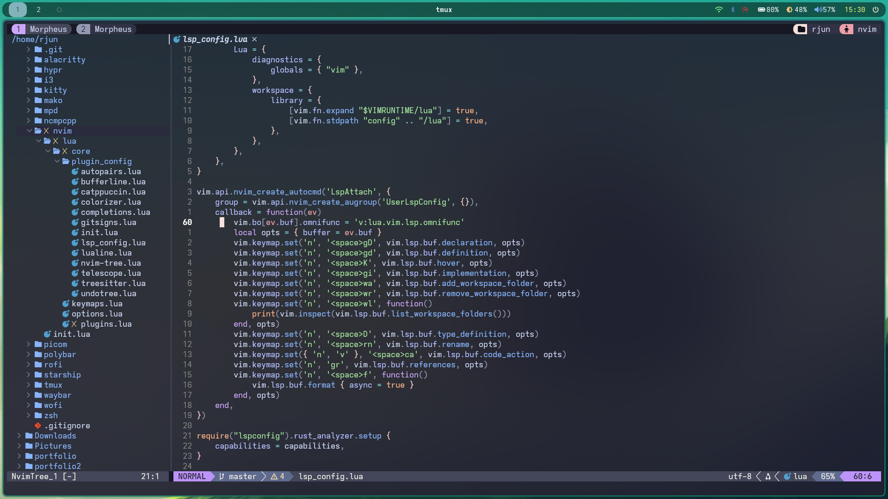

# Arch Linux Post-Install Script

This script automates the installation and setup of a **clean Arch Linux** environment, designed for a modern **Wayland-based** desktop with **Hyprland** and other essential tools.

---

### 🔧 Features
- **Wayland** with **Window Manager**
- **Waybar** for status bar
- **Kitty** as the terminal
- **Neovim** as the editor, with essential plugins
- **Blueman** for Bluetooth management
- **Tiling Window Manager** optimized for productivity
- **zsh** shell with **Starship** prompt and **fzf** for fuzzy searching
- **greetd** display manager with automatic Hyprland startup
- **Wireguard** tools for secure VPN connections
- **Custom dotfiles** configuration symlinked to `~/.config`

---

### ⚡ Quick Start
1. Clone this repository and run the post-install script:
   ```bash
   git clone https://github.com/km-rjun/dotfiles
   cd dotfiles
   ./run.sh

## 📸 Screenshots




